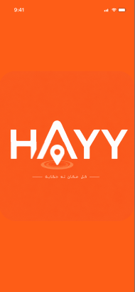
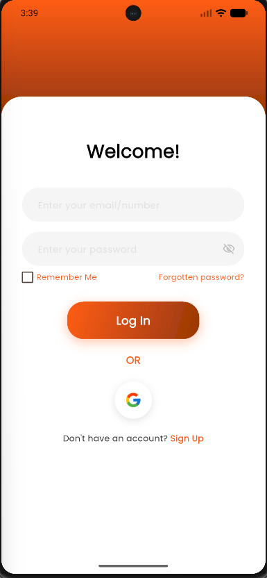
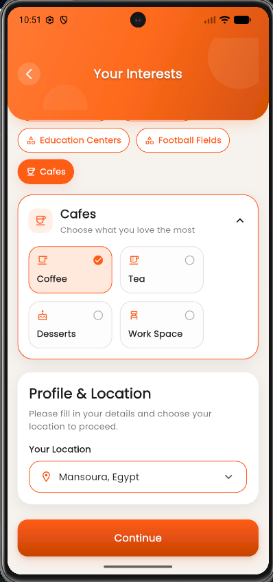
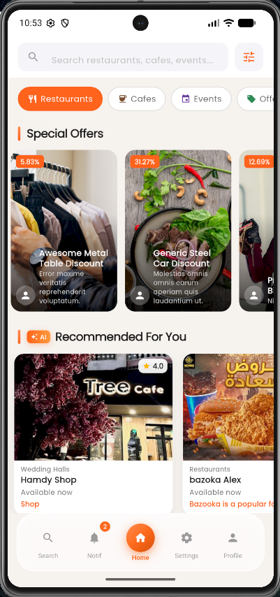
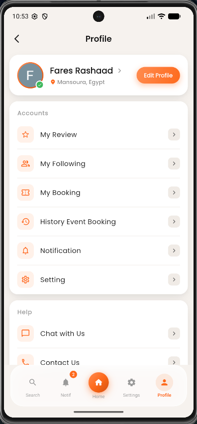
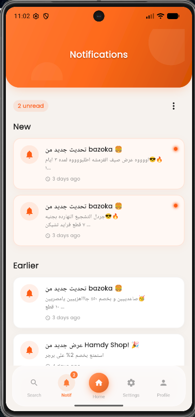
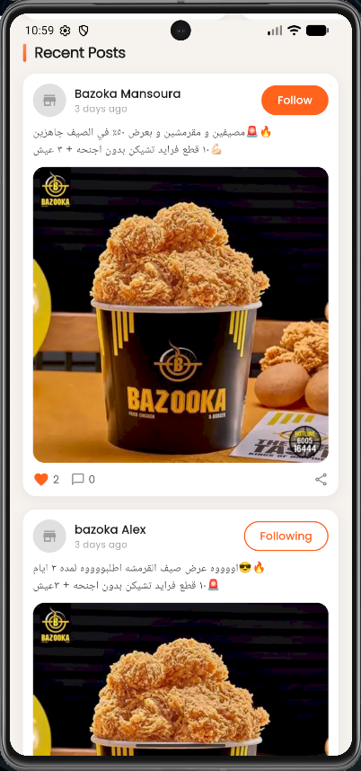
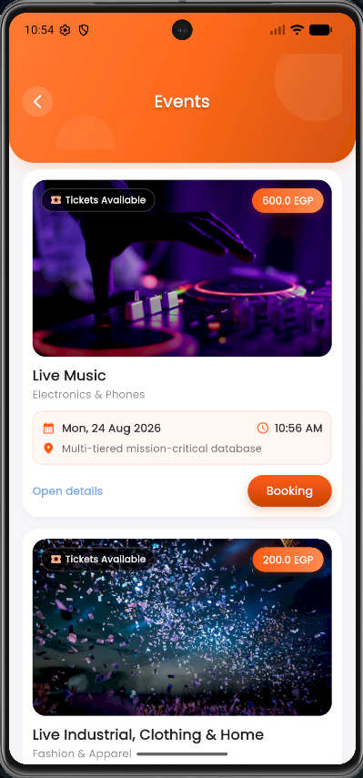

# <div align="center">

# 

# 

# 

# \# HAYY

# 

# \### Every Place Has a Story

# 

# A modern location-based mobile application that helps users discover nearby places, explore events, receive AI-powered recommendations, and connect with their local community.

# 

# !\[Flutter](https://img.shields.io/badge/Flutter-3.x-02569B?logo=flutter\&logoColor=white)

# !\[Dart](https://img.shields.io/badge/Dart-3.x-0175C2?logo=dart\&logoColor=white)

# !\[Platform](https://img.shields.io/badge/Platform-Android-success)

# !\[Architecture](https://img.shields.io/badge/Architecture-Clean%20Architecture-orange)

# !\[State Management](https://img.shields.io/badge/State-BLoC-blueviolet)

# 

# </div>

# 

# \---

# 

# \# 📖 Overview

# 

# HAYY is a smart location-based mobile application developed using Flutter.

# 

# The application helps users discover nearby restaurants, cafés, stores, events, and local businesses while providing personalized AI-powered recommendations based on user interests and location.

# 

# Users can browse places, follow businesses, view offers, book events, receive QR tickets, and interact with the community through reviews and posts.

# 

# \---

# 

# \# ✨ Features

# 

# \- 🔐 Secure Authentication

# \- 🔑 Google Sign-In

# \- ❤️ Personalized Interests

# \- 🤖 AI Recommendations

# \- 📍 Google Maps Integration

# \- 🔎 Smart Search

# \- 🏪 Place Details

# \- ⭐ Reviews \& Ratings

# \- 📝 Business Posts

# \- 🎁 Offers \& Promotions

# \- 🎫 Event Booking

# \- 📱 QR Ticket Generation

# \- ⚡ Real-Time Updates (SignalR)

# \- 👤 User Profile

# \- ❤️ Follow Businesses

# \- 📚 Booking History

# 

# \---

# 

# \# 🏗 Architecture

# 

# The application follows \*\*Clean Architecture\*\* combined with the \*\*BLoC Pattern\*\* to ensure scalability, maintainability, and clean separation of concerns.

# 

# ```

# Presentation Layer

# &#x20;       │

# Business Logic (BLoC)

# &#x20;       │

# Repository Layer

# &#x20;       │

# Remote Data Sources

# &#x20;       │

# REST API

# &#x20;       │

# ASP.NET Core Backend

# ```

# 

# \---

# 

# \# 🛠 Tech Stack

# 

# | Category | Technology |

# |-----------|------------|

# | Framework | Flutter |

# | Language | Dart |

# | Architecture | Clean Architecture |

# | State Management | flutter\_bloc |

# | Networking | Dio |

# | Dependency Injection | GetIt |

# | Authentication | Google Sign-In |

# | Maps | Google Maps SDK |

# | Secure Storage | Flutter Secure Storage |

# | Real-Time Communication | SignalR |

# | Backend | ASP.NET Core Web API |

# 

# \---

# 

# \# 📸 Application Screenshots

# 

# \## Authentication

# 

# | Splash | Login | Interests |

# |--------|-------|-----------|

# |  |  |  |

# 

# \---

# 

# \## Home

# 

# | Home | Profile | Notifications |

# |------|---------|---------------|

# |  |  |  |

# 

# \---

# 

# \## Discover Places

# 

# | Search | Place Details | Place Details |

# |---------|---------------|---------------|

# |  |  |  |

# 

# \---

# 

# \## Community

# 

# | Posts | Following | Offer Details |

# |--------|-----------|---------------|

# |  |  |  |

# 

# \---

# 

# \## Booking System

# 

# | Events | Book Tickets | My Booking |

# |---------|--------------|------------|

# |  |  |  |

# 

# | QR Ticket |

# |-----------|

# |  |

# 

# \---

# 

# \# 📂 Project Structure

# 

# ```text

# lib

# │

# ├── core

# ├── config

# ├── shared

# ├── features

# │   ├── authentication

# │   ├── home

# │   ├── search

# │   ├── places

# │   ├── booking

# │   ├── profile

# │   ├── notifications

# │   └── settings

# │

# └── main.dart

# ```

# 

# \---

# 

# \# 🚀 Getting Started

# 

# \### Clone Repository

# 

# ```bash

# git clone https://github.com/fares0101/Hayy\_App.git

# ```

# 

# \### Install Packages

# 

# ```bash

# flutter pub get

# ```

# 

# \### Run Application

# 

# ```bash

# flutter run

# ```

# 

# \---

# 

# \# 👨‍💻 Team

# 

# Graduation Project Team

# 

# \*\*Mobile Application\*\*

# \- Fares Rashad — Flutter Developer

# 

# \---

# 

# \# 📄 License

# 

# This project was developed as a Graduation Project for educational purposes.

